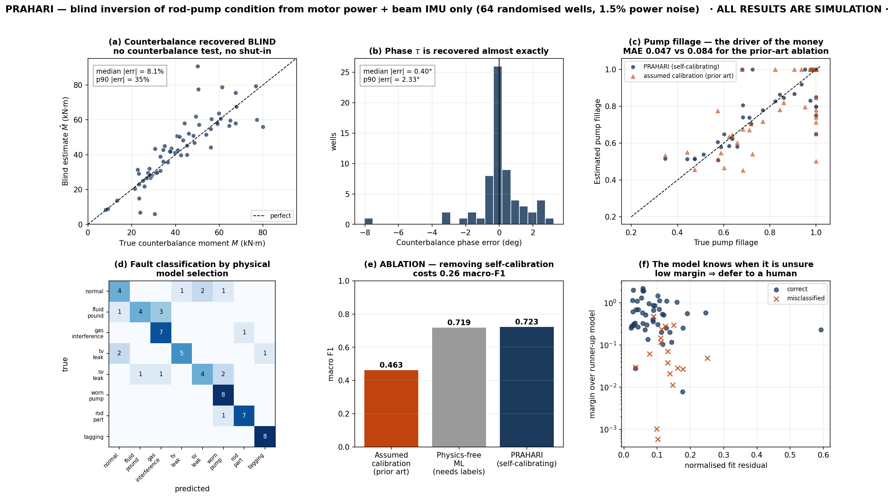
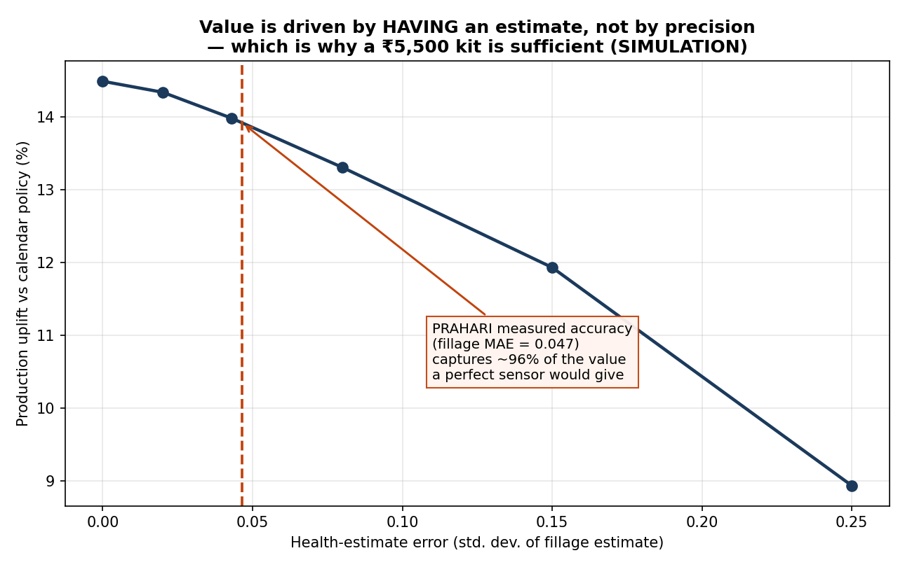
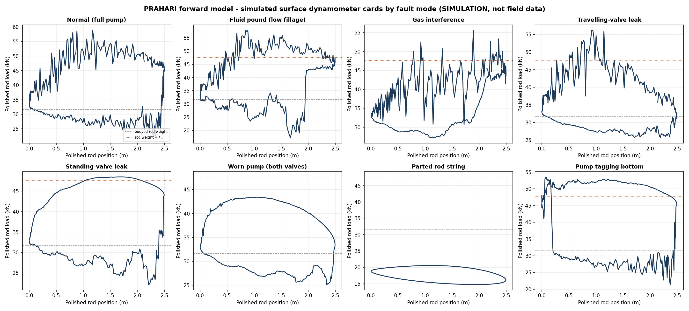

# PRAHARI
### Predictive Rod-lift Asset Health And Rig Intelligence

Estimating downhole sucker-rod-pump condition from **a clamp-on motor current sensor and a walking-beam IMU** — with **no polished-rod load cell, no counterbalance test, and no well shut-in** — and turning that estimate into a workover-rig schedule ranked by tonnes recovered per rig-day.

> **⚠️ Status: TRL 3–4. Every quantitative result in this repository is a SIMULATION result.**
> Ground truth is produced by our own forward physics model; the inverse solver never sees it. No field data has been used and no hardware has been built or tested. Field validation is Stage 2 of the roadmap and is explicitly not claimed here.

---

## At a glance

| | |
|---|---|
| **The problem** | India's crude import dependence hit a record **88.7%**; the Government attributes it to mature-field decline. In an ONGC mature asset, **>25% of rod-pumped wells are serviced yearly** and **40% of all workover jobs are rod-pump repairs — the job type with the least oil gain.** |
| **Why unsolved** | The fix (load cell + RTU) costs ~₹1.5–3 lakh/well and needs wellhead intervention. Not viable at 1–3 t/day, so marginal wells run blind. |
| **What's new** | Motor-power dynamometry is prior art and we cite it. The blocker is that every published method needs the **counterbalance moment** — unrecorded, physically hidden, measurable only by shutting the well in. **We identify it blind.** |
| **Headline result** | Counterbalance recovered blind to **8.1%** median error; pump fillage MAE **0.047**; removing self-calibration drops macro-F1 **0.723 → 0.463**. |
| **What it's worth** | **+13.5%** production and **+31%** tonnes per rig-day vs a condition-blind preventive policy (400 wells, 3 rigs, p = 2.5×10⁻¹³). |
| **Try it** | `streamlit run app.py` — configure a well, watch the inversion run against hidden ground truth. |

### The core result



*Blind inversion across 64 randomised wells. (a) counterbalance moment recovered with no test and no shut-in; (c) pump fillage — the quantity that drives the economics — against the prior-art ablation; (e) removing self-calibration costs 0.26 macro-F1; (f) the fit residual and model margin separate the misclassifications, so the system knows when it is unsure.*

### Why a ₹5,500 sensor is enough



*At our measured accuracy the scheduler captures ~96% of the value a perfect sensor would deliver. The value is in **having** an estimate, not in precision — which is the entire commercial argument.*

### The physics is real, not a shape template



*Surface dynamometer cards produced by integrating the damped wave equation with a physical pump boundary condition. Fluid-pound ringing, the drooping travelling-valve-leak flank and the collapsed worn-pump ellipse emerge from the physics — they are not drawn in.*

---

## Documentation index

| Document | Contents |
|---|---|
| [`docs/PRIOR_ART.md`](docs/PRIOR_ART.md) | Prior-art review, what is and isn't claimed as new, IP notes |
| [`docs/DESIGN_NOTES.md`](docs/DESIGN_NOTES.md) | Modelling decisions, numerical issues, technical FAQ, limitations |
| [`docs/ECONOMICS.md`](docs/ECONOMICS.md) | Bill of materials, value model, scenarios, deployment path, risk register |
| [`docs/REFERENCES.md`](docs/REFERENCES.md) | Every claim, its source and its evidence class |

---

## 1. The problem

India's crude oil **import dependence reached a record 88.7 % in 2025-26** while domestic production fell from 29.7 to 28.0 MMT over five years. The Government attributes the decline *"primarily [to] natural decline in mature and ageing oil and gas fields"*.

In those mature onshore fields, the sucker rod pump dominates. Peer-reviewed data from an Indian ONGC asset reports:

- **more than 25 % of rod-pumped wells required a well-servicing job within a year**
- **up to 40 % of all workover jobs are rod-pump repairs — and they deliver the least oil gain of any job type**
- mean time between failures **as low as 4–5 months**

So the binding constraint in a mature asset is **workover rig-days**, and roughly 40 % of them go to the lowest-value work. That is not a maintenance problem. It is a capital-allocation problem.

**Why it isn't already solved.** Condition monitoring for rod pumps exists and works — polished-rod load cell + position transducer + RTU. But it costs on the order of ₹1.5–3 lakh per well installed *(estimate)* and needs wellhead intervention. You cannot justify that on a well making 1–3 tonnes/day, so most of India's marginal rod-pumped wells are **not instrumented at all** and are run reactively.

---

## 2. What is genuinely new here

Inferring a dynamometer card from motor electrical data is **not new** — it is ~14 years old and well published (IEEE 2012, 2022, 2023; *Control Engineering Practice* 2019). We cite it and we do not claim it.

What blocks it from deployment is one specific dependency: **every published method requires the maximum counterbalance moment `M` and structural unbalance `SU` as inputs.** On a 40-year-old brownfield unit these are:

- not recorded (counterweights are moved and never logged),
- physically hidden (auxiliary weights sit inside the master-weight pocket),
- obtainable only by a counterbalance test that **requires shutting the well in**.

PRAHARI's contribution is a three-part combination for which we found no prior art:

1. **Blind self-calibration** — joint identification of `M`, `τ`, `SU` and an effective geometry scale directly from operating data, with no test and no shut-in.
2. **Calibrated-uncertainty health inference** — a posterior over *physical* parameters (fillage, leak rates, net stroke) with a residual-based confidence, so the system can say *"I don't know."*
3. **A decision-coupled objective** — the optimisation target is **tonnes recovered per rig-day across a fleet**, not per-well classification accuracy.

### How the self-calibration works

The motor observes

```
P(θ) = [ κ·g(θ)·(PRL(θ) − SU) − M·sin(θ+τ) ] · ω(θ) / η  +  P₀
```

where `g(θ) = ds/dθ` and `ω(θ)` are measured **exactly** by the beam IMU.

For any candidate pump-health vector, this is **linear** in `(κ, κ·SU, M·cosτ, M·sinτ, P₀)`. So we solve the calibration in **closed form** by least squares and search only over the 1–4 dimensional pump-health manifold — classical **variable projection (VarPro)**.

**Why it's identifiable:** the counterbalance is a *pure first harmonic*. It could be absorbed into the rod-torque term only if `PRL` were unconstrained — but `PRL` must be an admissible solution of the damped wave equation, spanned by a handful of parameters. That physical constraint breaks the degeneracy. We *measure* the residual degeneracy rather than asserting it.

---

## 3. Results (simulation)

64 randomised wells — depth 700–1700 m, three rod sizes, 4–9 SPM, randomised unit geometry, damping and counterbalance de-tuning — with 1.5 % motor-power noise and 0.05° IMU noise.

**Anti-"inverse crime" measures:** ground truth runs at 48 nodes / 3 warm-up cycles / 360 crank samples; the inverse model runs at 24 nodes / 1 warm-up cycle / 180 samples. The solver is deliberately a coarser, mismatched model.

| Quantity | Result |
|---|---|
| Counterbalance moment `M`, **recovered blind** | median abs. error **8.1 %** (p90 34.9 %) |
| Counterbalance phase `τ` | median abs. error **0.40°** (p90 2.33°) |
| **Pump fillage** | **MAE 0.047** |
| Fault classification (8 classes) | **73.4 % accuracy, macro-F1 0.723** |

### Ablations — does the new part actually matter?

| Method | Fillage MAE | macro-F1 |
|---|---:|---:|
| **PRAHARI (self-calibrating)** | **0.047** | **0.723** |
| Assumed calibration *(the prior-art approach, given a drifted nameplate value)* | 0.084 | 0.463 |
| Physics-free ML (Random Forest on the same raw signals) | n/a — gives no fillage | 0.719 |

Two honest readings of this table:

- **Removing self-calibration costs 0.26 macro-F1 and doubles the fillage error.** That is the core claim, directly measured.
- **The physics-free ML baseline ties us on classification.** We say so openly. But it (a) required 240 *labelled* training wells, which do not exist in the field, and (b) outputs a label and nothing else — no fillage, no calibration, no card. Experiment 4 shows the money comes from **fillage**, which the classifier cannot produce.

### Fleet economics (Experiment 4)

400 wells, 3 rigs, 365 days, 12 paired replicates, health-estimate noise set to the **measured** fillage MAE.

| Policy | Recovery | Unplanned failures/yr | Marginal t / rig-day |
|---|---:|---:|---:|
| Reactive (run-to-failure) | 70.7 % | 121 | 50.5 |
| Calendar (condition-blind preventive) | 73.0 % | 105 | 53.7 |
| **PRAHARI** | **83.0 %** | **32** | **70.4** |

- **+13.5 % production vs the calendar policy** (p = 2.5 × 10⁻¹³, paired t-test)
- **+31 % marginal tonnes per rig-day**
- **Model self-validation:** the reactive baseline independently reproduces a **28.6 % annual well-servicing rate**, against the published ONGC Mehsana figure of *">25 % within a year"*. We did not tune to this.

### The result that justifies a cheap sensor

| Health-estimate noise σ | Uplift vs calendar |
|---:|---:|
| 0.00 (perfect sensor) | 14.5 % |
| **0.043 (our measured accuracy)** | **14.0 %** |
| 0.25 (very poor sensor) | 8.9 % |

At our measured accuracy we capture **~96 % of the value a perfect sensor would deliver.** A ₹1.5 lakh load cell cannot beat a ₹5,500 kit by more than about half a percentage point.

---

## 4. Reproducing everything

```bash
pip install -r requirements.txt

# Exp 1  forward-model validation + card gallery      (~30 s)
python experiments/exp1_forward_validation.py

# Exp 2  blind calibration / health / classification  (resumable; re-run until DONE)
python experiments/exp2_inversion_study.py --budget 95

# Exp 4  fleet prognostics + rig scheduling           (~60 s)
python experiments/exp4_fleet_scheduling.py --reps 12

# Figures
python experiments/exp5_make_figures.py

# Live demo
streamlit run app.py
```

`exp2` checkpoints after every well and exits at its time budget — re-run it until it prints `DONE`. Per-well RNG is derived from `(seed, index)`, so results are identical regardless of how the run is chunked.

---

## 5. Repository layout

```
src/
  kinematics.py   API Spec 11E four-bar unit geometry; torque factor by virtual work
  rodstring.py    damped wave equation (Gibbs 1963) + physical pump fault state machine
  forward.py      full observation chain -> motor power + beam IMU (the only observables)
  batch_sim.py    vectorised solver, ~39x faster, bit-exact vs the scalar reference
  inverse.py      << CORE >> blind self-calibrating VarPro inversion + ablation baseline
experiments/      exp1 validation · exp2 inversion study · exp4 fleet · exp5 figures
results/          CSV + JSON outputs
figures/          generated figures
app.py            Streamlit technology demonstrator
```

---

## 6. Limitations — stated plainly

- **Simulation only.** No hardware built, no field data, no pilot. TRL 3–4.
- **Fluid-load magnitude `Fo` is poorly identified** (median error ~34 %) because it is multiplicatively confounded with `κ`. Pump *fillage* — a ratio, and the quantity that drives the economics — is identified well. We report both.
- **Conventional crank-balanced units only.** Mark-II and air-balanced units need a different kinematic model.
- Real motor power contains supply harmonics, VFD switching and grid disturbances absent from our model. Band-limiting discards high-frequency content, but the real spectrum must be measured in Stage 2.
- The `p90` counterbalance error of 35 % shows a tail of hard wells. The confidence signal (fit residual + margin over the runner-up model) separates most of these, but not all.
- The incumbent cost figure (₹1.5–3 lakh/well) is an **order-of-magnitude estimate**, not a verified quotation.

---

## 7. Next step

Five wells that **already have a dynamometer**. That gives a true surface card as ground truth on day one and converts every simulated result here into a measured one — or falsifies it. It is the cheapest decisive experiment available.

---

## 8. References

Gibbs, S.G. (1963), *Predicting the behavior of sucker-rod pumping systems*, JPT — the damped wave equation used here.
API Spec 11E — pumping unit geometry conventions.
Prior art on motor-power dynamometry and card classification is catalogued in [`docs/PRIOR_ART.md`](docs/PRIOR_ART.md), with an explicit statement of what is and is not claimed as new.

---

## 9. Citation

```
Sahare, T. (2026). PRAHARI: Blind self-calibrating rod-pump condition inference
from motor power and walking-beam inertial data.
https://github.com/tanmaysahare/prahari
```
